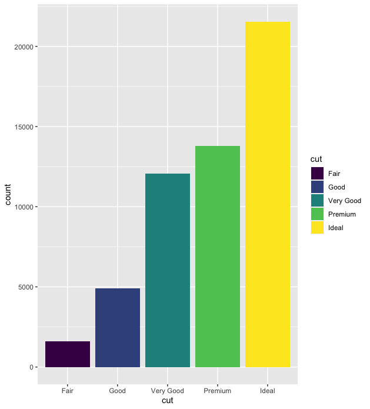
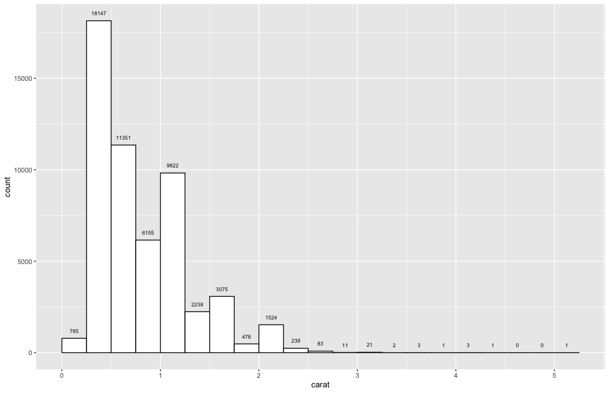
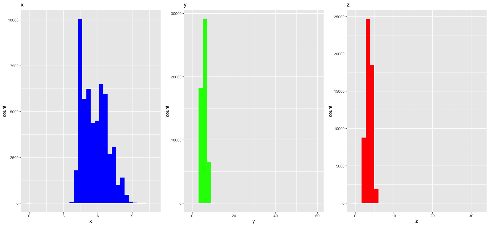
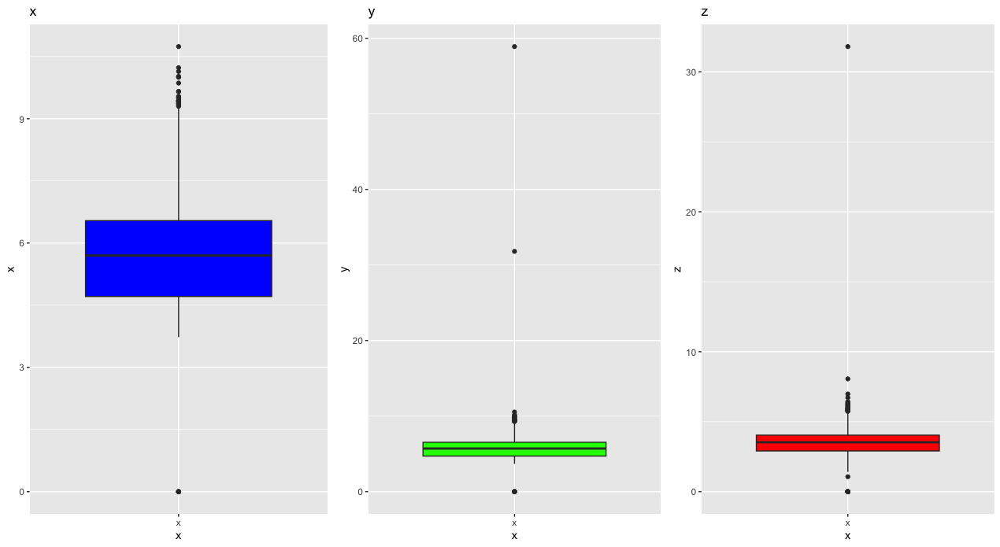
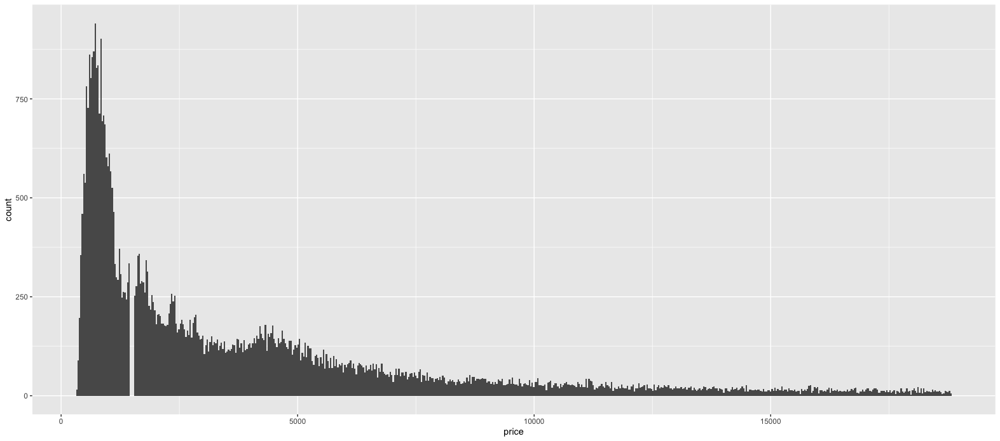

# Project work 1

``` R
install.packages("ggplot2")
library("ggplot2")
head(diamonds)
```

## Exercise 1

``` R
cut_counts = table(diamonds$cut)
cut_percentages = round((cut_counts / sum(cut_counts)) * 100, digits = 2)

cut_percentages
ggplot(diamonds, aes(x = cut, fill = cut)) + geom_bar()
```

Most common cut type is ideal. 40% of cuts are ideal. 
Percentages:

Fair = 2.98,
Good = 9.10,
Very good = 22.40,
Premium = 25.57,
Ideal = 39.95



## Exercise 2

``` R
ggplot(diamonds, aes(carat)) + 
  geom_histogram(binwidth = 0.25, boundary = 0, color = "black", fill = "white") +
  stat_bin(binwidth=0.25, boundary = 0, geom="text", size = 2.5, aes(label=..count..), vjust=-1.5)
  
# Collect all diamonds where carat is larger than 3: 
diamonds_larger_than_3 = diamonds[diamonds$carat > 3,]

# Print number of rows (Amount of diamonds with carat larger than 3)
print(nrow(diamonds_larger_than_3))
```


## Exercise 3

``` R 
summary(diamonds$x)
summary(diamonds$y)
summary(diamonds$z)

```


``` R
# Histograms. I found package gridExtra to display all side by side. 

install.packages("gridExtra")
library(gridExtra)

h1 <- ggplot(diamonds, aes(x = x)) + geom_histogram(fill = "blue") + ggtitle("x")
h2 <- ggplot(diamonds, aes(x = y)) + geom_histogram(fill = "green") + ggtitle("y")
h3 <- ggplot(diamonds, aes(x = z)) + geom_histogram(fill = "red") + ggtitle("z")

grid.arrange(h1, h2, h3, ncol = 3)
```


``` R
# Boxplots

b1 <- ggplot(diamonds, aes(x = "x", y = x)) + geom_boxplot(fill = "blue") + ggtitle("x")
b2 <- ggplot(diamonds, aes(x = "x", y = y)) + geom_boxplot(fill = "green") + ggtitle("y")
b3 <- ggplot(diamonds, aes(x = "x", y = z)) + geom_boxplot(fill = "red") + ggtitle("z")

grid.arrange(b1, b2, b3, ncol = 3)
```


### Answer: 
There are multiple 0 values. 0 values are propapbly mistakes because 0 value is not possible. 
Distribution of variables seems normal, but there are couple outliers and outliers should be investigated to determine if they are errors. If they are errors , they should be corrected or removed. 

## Exercise 4 

```R 
# Histogram, binwidth = 30
ggplot(diamonds, aes(price)) + geom_histogram(binwidth = 30)
```


```R
# Lets focus on that cap around 1000 & 2000
ggplot(diamonds, aes(price)) + geom_histogram(binwidth = 30) + xlim(1000, 2000)
```

